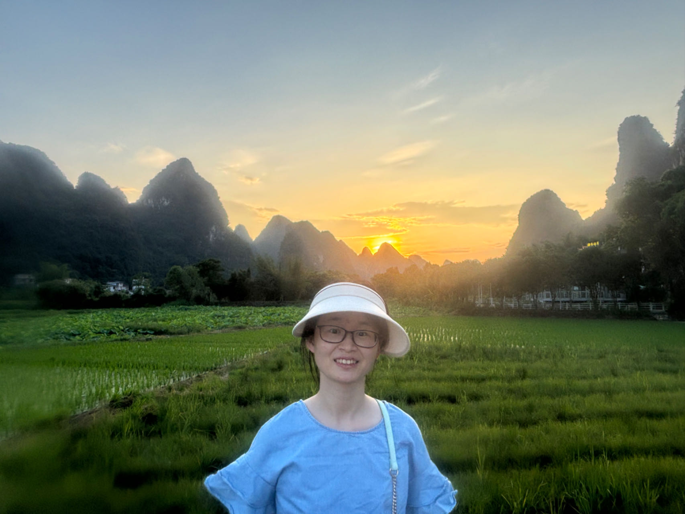
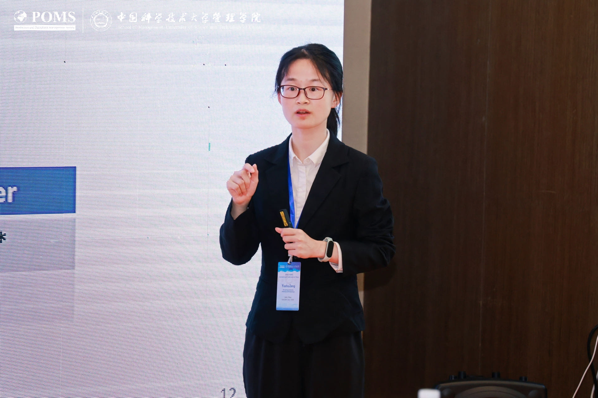

---
# Leave the homepage title empty to use the site title
title: ""
date: 2022-10-24
type: landing

design:
  # Default section spacing
  spacing: "6rem"

sections:
  - block: resume-biography-3
    content:
      # Choose a user profile to display (a folder name within `content/authors/`)
      username: admin
      text: ""
      # Show a call-to-action button under your biography? (optional)
      button:
        text: Download CV
        url: uploads/resume.pdf
    design:
      css_class: dark
      background:
        color: black
        image:
          # Add your image background to `assets/media/`.
          filename: stacked-peaks.svg
          filters:
            brightness: 1.0
          size: cover
          position: center
          parallax: false
#  - block: markdown
#    content:
#      title: 'Education'
#      text: |-
#        **PhD in Empirical Operations Management**  
#        Hong Kong University of Science and Technology (2019-2025)
#
 #       **BSc in Mnagement Science**  
  #      University of Science and Technology of China (2015-2019)
#I employ econometrics, machine learning, and game theory to study research problems in operations-marketing interface, platform operations, socially responsible operations, economics of information, digitization, and artificial intelligence. I choose the most appropriate methodology according to the research problems.
 #       **Summer Visiting in Information System**  
  #      University of Washington (2018)
   # design:
    #  columns: '1'
  - block: markdown
    content:
      title: 'Research Interest'
      text: |-
        **Applications**  
        Operations-Marketing Interface; Platform Operations; Socially Responsible Operations; Economics of Information, Digitization, and Artificial Intelligence. 
        I hope my research could contribute positively to the world.

        **Methodologies**  
        Econometrics; Machine Learning; Game Theory.  
        I choose the most appropriate methodology according to the research problems.
    design:
      columns: '1'
  - block: markdown
    content:
      title: 'Working Papers'
      text: |-
        **Attribute and Quality Information Disclosure on Digital Content Platforms: Theory and Empirical Evidence**  
        with Hu Huang, Ying-Ju Chen, Xin Wang. Submitted to MSOM. Job Market Paper.  
        **Details**: This paper theoretically and empirically explores information disclosure strategies in the digital content platform. Our results indicate that firms with higher vertical quality are less likely to disclose attribute information to consumers, irrespective of the availability of quality information.

        **Mergers and Product Repositioning: Theory and Empirical Evidence**  
        with Soo-Haeng Cho, Zijun Shi, Xin Wang. Ready for submission.  
        **Details**: This paper theoretically and empirically evaluates the merger effects of consumer welfare after product repositioning. A merger between two firms in the high-end markets is possible to improve consumer surplus, whereas a merger between two firms in the low-end markets always hurts consumers.

        **Text-Based Measurement and Analysis of Firm-Level Price Expectations from Earnings Call Transcripts**  
        with Yunning Zhao, Ying-Ju Chen. Ready for submission.  
        **Details**: This paper utilizes the textual analysis method (BERT) to develop a paradigm for measuring firms’ expectations and construct a novel firm-level indicator of firms’ price expectations based on over 400, 000 quarterly earnings conference-call transcripts.
    design:
      columns: '1'
  - block: markdown
    content:
      title: 'Work in Process'
      text: |-
        As a researcher in empirical operations management, I have established many strong connections with industry and academia. Typically, it takes several years to await the outcomes of an empirical research project. Patience, enthusiasm, and a touch of luck are indispensable companions on this academic journey. I list some of my ongoing work here.

        **Selling Virtual Currency in Free-to-Play Mobile Games: Theory and Empirical Evidence**  
        with Ying-Ju Chen. 
        **Details**: This paper theoretically and empirically examines the optimal virtual currency strategy of the free-to-play mobile game design scenario. The data is obtained through a game data agency who provides everyday investigations over apps across different platforms.

        **AI in Fundraising: Predictive Modeling in Charitable Giving**  
        with Ying-Ju Chen, Dejie Kong. 
        **Details**: This paper aims to help prosocial organizations to find their optimal fundraising strategies. The data is obtained through a prosocial data platform who provides services to a large number of NGOs.

        **Optimal Pricing and Promotion Strategies for an AI Startup Offering Software-Hardware Emotion Solutions**  
        with Ying-Ju Chen, Jingyang Wu. 
        **Details**: This paper aims to help AI startup in their beginning period. The data is obtained from an AI startup company.
    design:
      columns: '1'
  - block: markdown
    content:
      title: 'Teaching'
      text: |-
        **Courses I have served as a teaching assistant:**  
        Optimizing Decisions for Personal and Business Development (Undergraduate Spring 2023)  
        Industrial Engineering and Decision Analytics (Undergraduate Fall 2020, Fall 2021)  
        Engineering Management (Undergraduate Spring 2019)  
        Service Engineering and Management (Undergraduate Spring 2020, Spring 2021, Fall 2022)  
        Operation/Production Management (Master Spring 2021)  
        Global Supply Chain Management (Master Fall 2022) 

        **My duties:** Give weekly tutorial, assignment and exam design, lecture assistant, grading work, office hour. Students said that I was friendly and helpful. ❤️ 
    design:
      columns: '1'
  - block: markdown
    content:
      title: 'Hobbies'
      text: |-
        I love hiking, traveling, reading, and so on. 

        **Hiking**   
        
        Hello, the fantastic world! :)

        **Traveling**   At times, I can learn the invaluable stories of local people. I treasure them a lot.
        
#
   #     **Sharing**  
   #     
    design:
      columns: '1'
 # - block: collection
  # content:
   #   title: Working Papers
    #  text: ""
     # filters:
      #  folders:
       #   - publication
        #exclude_featured: false
   # design:
    #  view: citation
#  - block: collection
 #   id: talks
  #  content:
   #   title: Recent & Upcoming Talks
    #  filters:
 #       folders:
  #        - event
  #  design:
   #   view: article-grid
    #  columns: 1
 # - block: collection
  #  id: news
   # content:
  #    title: Recent News
 #     subtitle: ''
   #   text: ''
      # Page type to display. E.g. post, talk, publication...
    #  page_type: post
      # Choose how many pages you would like to display (0 = all pages)
     # count: 5
      # Filter on criteria
      #filters:
     #   author: ""
    #    category: ""
      #  tag: ""
       # exclude_featured: false
        #exclude_future: false
       # exclude_past: false
        #publication_type: ""
      # Choose how many pages you would like to offset by
    #  offset: 0
      # Page order: descending (desc) or ascending (asc) date.
   #   order: desc
  #  design:
      # Choose a layout view
   #   view: date-title-summary
      # Reduce spacing
   #   spacing:
   #     padding: [0, 0, 0, 0]
  - block: cta-card
    demo: true # Only display this section in the Hugo Blox Builder demo site
    content:
      title: 👉 Build your own academic website like this
      text: |-
        This site is generated by Hugo Blox Builder - the FREE, Hugo-based open source website builder trusted by 250,000+ academics like you.

        <a class="github-button" href="https://github.com/HugoBlox/hugo-blox-builder" data-color-scheme="no-preference: light; light: light; dark: dark;" data-icon="octicon-star" data-size="large" data-show-count="true" aria-label="Star HugoBlox/hugo-blox-builder on GitHub">Star</a>

        Easily build anything with blocks - no-code required!
        
        From landing pages, second brains, and courses to academic resumés, conferences, and tech blogs.
      button:
        text: Get Started
        url: https://hugoblox.com/templates/
    design:
      card:
        # Card background color (CSS class)
        css_class: "bg-primary-700"
        css_style: ""
---
